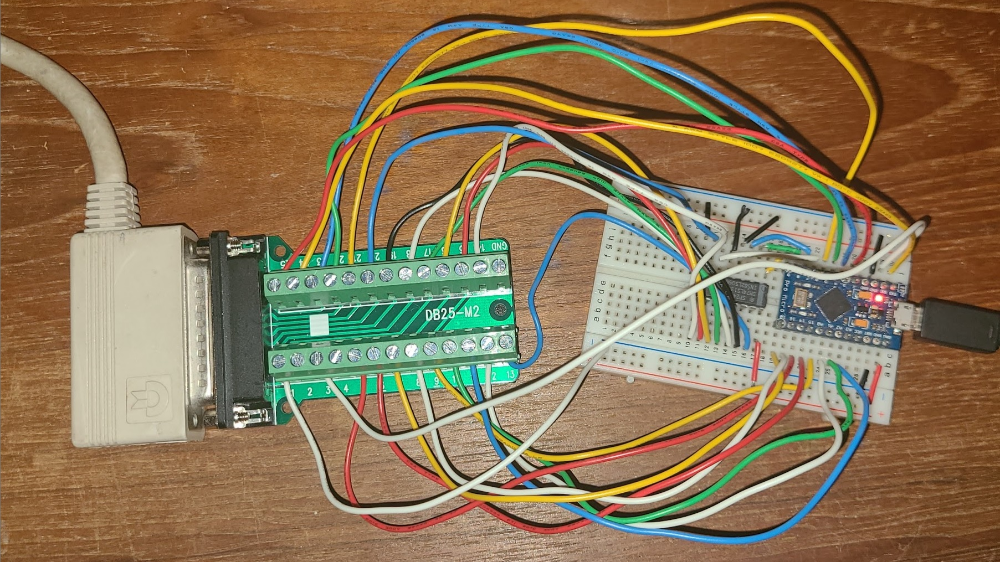

## C128D to USB keyboard HID driver ##

This hardware and software allows a Commodore 128D keyboard to be used as an almost(*) standard USB keyboard. (*keys like braces, tilde, back quote, F9-F12 are missing)

    LINE FEED = NUM LOCK
    HELP = F1
    Numeric keypad can double as cursor keys, home/end, page up/down when NUM LOCK is toggled off
    C= = WINDOWS KEY
    STOP = PAUSE/BREAK
    NO SCROLL = SCROLL LOCK

Status: some multiple key presses (same row) issues.  Maybe an electrical pull-up or sink current issue?

Previously shows latest scan code 0..88 plus Caps/Display/Restore to USB serial port via Arudino Pro Micro (3U4) and 74LS138.  Code in Arduino IDE.
(Note: previous version omits 74LS138 to only do 64 keys.)

DB-25 to Pro Micro wiring instructions are in source code.  74LS138 wiring instructions can be inferred from source code and searching for datasheet.

[Reference C128 Keyboard @ zimmers](http://www.zimmers.net/anonftp/pub/cbm/schematics/computers/c128/servicemanuals/manual/51.gif)
