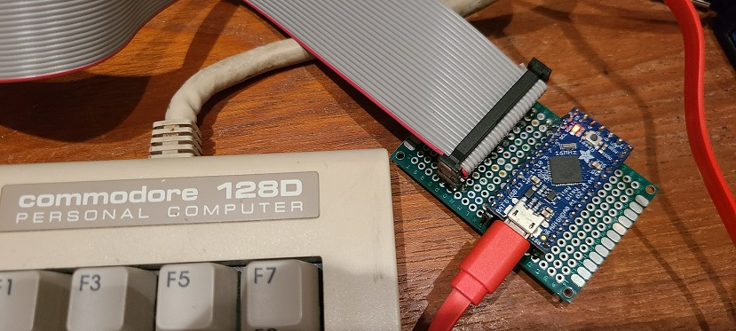
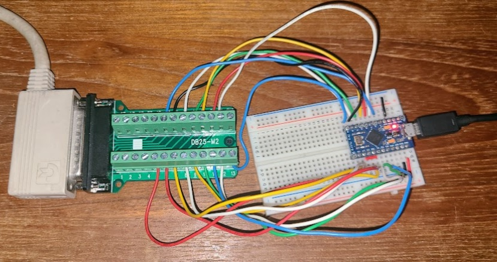

# Commodore to USB keyboard HID driver #

## [Adafruit ItsyBitsy](https://learn.adafruit.com/introducting-itsy-bitsy-32u4/) version ##

This hardware and software allows a Commodore 64, 128, or Vic-20 keyboard to be used as a USB HID keyboard.  The keyboard pin numbers are the same between all the Commodore systems (e.g. single inline pins for most with key at pin 2, or DB-25 for external keyboard with 128D). The use of ItsyBitsy allowed all the extra lines necessary to support the extra keys added for C128.  ItsyBitsy is an alternate form factor related to [Arduino Leonardo](https://docs.arduino.cc/hardware/leonardo) with all the extra lines of the 32U4 present.  The [ATmega32U4](https://www.microchip.com/en-us/product/atmega32u4) has the ability to directly act as a USB HID device in conjuction with the Arduino keyboard library.  Utilizing a DB-25 to 0.1" 2.54mm pitch dual row pin socket adapter for the first hand soldered and wired circuit board to make it both easier to build and semi-permanent.

Status: Working 88+ key solution. Multiple keys pressed on same row issue has been resolved (only one column output must be active at one time, otherwise change column to a HIGH-Z input to avoid competing low and high outputs). 

Multiple branches are present for this repository

* main - merge from ninetyone_hid_itsy_bitsy
* [ninetyone_hid_itsy_bitsy](https://github.com/davervw/c128_keyscan/tree/ninetyone_hid_itsy_bitsy) - working C128 HID driver using Adafruit ItsyBitsy
* [ninetyone_serial_itsy_bitsy](https://github.com/davervw/c128_keyscan/tree/ninetyone_serial_itsy_bitsy) - working C128 serial scancode 0..88 + RESTORE, CAPS, DISP reporter to USB serial using Adafruit ItsyBitsy
* [sixtyfour_hid_pro_micro](https://github.com/davervw/c128_keyscan/tree/sixtyfour_hid_pro_micro) - working C128 HID driver using Arduino Pro Micro
* [sixtyfour_serial_pro_micro](https://github.com/davervw/c128_keyscan/tree/sixtyfour_serial_pro_micro) - working C664 serial scancode 0..64 + RESTORE reporter to USB serial using Arduino Pro Micro

Notes:

    RESTORE key mapping not included in this iteration.

    WARNING!!! wiring has changed between various commits. Always review DB-25 to Pro Micro wiring instructions which are in source code comments.  

Links

* [Reference C128 Keyboard @ zimmers](http://www.zimmers.net/anonftp/pub/cbm/schematics/computers/c128/servicemanuals/manual/51.gif)
* [Blog: Extremely small emulated C64](https://techwithdave.davevw.com/2023/06/extremely-small-emulated-c64.html)
